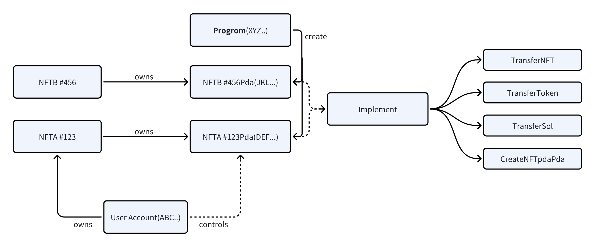
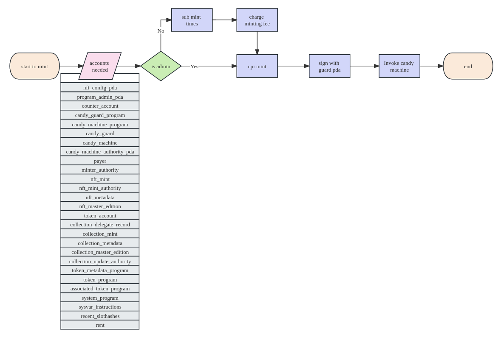
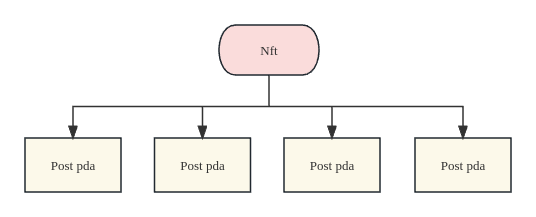

<div align="center">
  
</div>

<h3 align="center">Roseite</h3>

<div align="center">
  <h3> A Fully On-Chain Social Platform</h3>
  <br>
  <a href="https://github.com/BTHDMS/solana6551"><strong>Solana-6551 protocol(tentative) »</strong></a>
  <br>
</div>

<p align="center">
   
</p>

<p align="center">
  
</p>

## Table of Contents

- [Introduce](#introduce)
  - [Advantages](#advantages)
- [Solana-6551 protocol(tentative)](#solana-6551-protocol)
- [SocialFi](#socialfi)
  - [Structure](#structure)
  - [Main Features](#main-features)
    - [Dynamically add mint whitelist](#dynamically-add-mint-whitelist)
    - [Post Pda](#post-pda)
  - [Use Case](#use-case)
    - [Choose NFT Account](#choose-nft-account)
    - [Tweet](#tweet)
    - [Like and Comment](#like-and-comment)
  - [Potential](#potential)
- [Program](#program)
  - [Smart Contract](#smart-contract)
    - [Building](#building)
    - [Deploying](#deploying)
    - [Testing](#testing)
  - [Frontend](#frontend)
    - [Installing](#installing)
    - [Run](#run)

# Introduce

**Roseite** is a fully Solana on-chain SocialFi platform. Importantly, we will use NFTs as a social account instead of a wallet account, achieving greater decentralization while enhancing the practical value of NFTs.

Additionally, due to the unique product model of Roseite, we propose a protocol resembling ERC-6551 to unlock more playstyles and increase the true use value of NFTs.

It's worth noting that the core of this project lies in the implementation of the [Solana-6551 protocol](https://github.com/BTHDMS/solana6551) and the product model of account NFTification. Roseite is a bold and innovative attempt, and we hope to apply this model to GameFi or other NFTs in the future, subverting existing playstyles and developing unique ones based on the characteristics of Solana.

<u>This project made a breakthrough from 0 to 1 during the Solana hackathon and will need more time to realize our ideas</u>.

## Advantages

1. **Greater decentralization:** Owning the NFT account means possessing all associated properties, including posts and potential earnings.
2. **Improved incentivization mechanism:** Users can directly tip high-quality post PDAs, allowing NFT holders attached to those posts to claim the profits. This establishes a positive cycle of high-quality content and profits.
3. **Enhanced value of NFTs:** The value of NFTs will be determined by NFT holders who attract followers through engaging content and generate profitable posts, thus increasing traffic to their NFT accounts. Additionally, these NFTs can be listed for sale on mainstream NFT marketplaces like Magic Edgn.
4. **Superior protocol:** Utilizing the design of NFT accounts,[Solana-6551 protocol](https://github.com/BTHDMS/solana6551) will enable the holding of multiple subsidiary NFTs under primary NFTs. Ownership changes in the parent NFT will reflect in the child NFTs, but child NFTs can also be transferred independently.
5. **Improved content filtration mechanism:** Leveraging Solana's unique modeling mechanism, we aim to promote high-quality content and minimize irrelevant posts by regulating post PDA rents, ensuring a healthy balance within Roseite.

# Solana-6551 protocol
It's worth noting that the [Solana-6551 protocol](https://github.com/BTHDMS/solana6551) and account NFTization are the core of this project. SocialFi is just an interesting experiment with this concept. In the future, we hope to come up with some gameplay that subverts the existing NFT and GameFi mechanisms, enhancing user fun and experience while pushing further towards decentralization.

The following image outlines the fundamental model structure of Solana-6551(tentative). Visit [Solana-6551 protocol](https://github.com/BTHDMS/solana6551) for detailed information.


# SocialFi

## Structure

```
├── app -- Roseite frontend
│   ├── public
│   └── src
├── images
├── migrations
├── programs
│   └── NFT_social_media -- Solana program
├── target -- compiling file
│   ├── bpfel-unknown-unknown
│   ├── debug
│   ├── deploy
│   ├── idl
│   ├── release
│   └── types
├── tests
└── utils -- testing
```

## Main Features

### Dynamically add mint whitelist

NFTs in Roseite complies with the Metaplex NFT standard, and is used with candy guard to dynamically add mint whitelist.



### Post Pda

Roseite was born thanks to Solana's unique Pda model. Posts in Roseite will realize full data on-chain through pda. At the same time, when the ownership of NFT is transferred, new holders will have all post pda under their NFT to achieve the purpose of increasing the value of NFT.



## Use Case

### Choose NFT Account

The "Choose NFT Account" feature allows users to select an NFT account from their wallet. This feature is unique to Roseite and sets it apart from other SocialFi platforms. By allowing users to manage multiple accounts, it provides convenience for future transactions.

### Tweet

The "Tweet" feature is similar to posting on Twitter. Users can send text and tag content on Roseite. It enables users to share their thoughts, ideas, or updates with the Roseite community.

### Like and Comment

The "Like and Comment" feature serves as a form of affirmation for creators' content. The more likes and comments a post receives, the higher its perceived value and price. These interactions contribute to the account's assets and can be traded in the future.

## Potential

- Because of the transparency of web3, user profiling can be better achieved.
- Using Solana's Lookup table feature, users can store up to 255 \* 3MB = 756MB of content on the chain at most.
- According to the unique model of Solana, the extension of the [Solana-6551 protocol](https://github.com/BTHDMS/solana6551) makes the gameplay more diverse.
- Applying this set of product models and protocols to the GameFi field is aimed at subverting the existing gameplay of GameFi and NFTs.

# Program

## Smart Contract

### Building

**note:Please make sure the environment contains anchor, solana-cli, rustc before running this project**

```
anchor build
```

After running the command, the target file will be generated in the root directory

### Deploying

```
anchor deploy
```

According to the Anchor.toml configuration file, deploy the contract to the chain through solana-cli

### Testing

```
anchor test
```

Testing

## Frontend

### Installing

```
cd app
yarn
```

Install dependencies

### Run

```
yarn dev
```

start frontend
